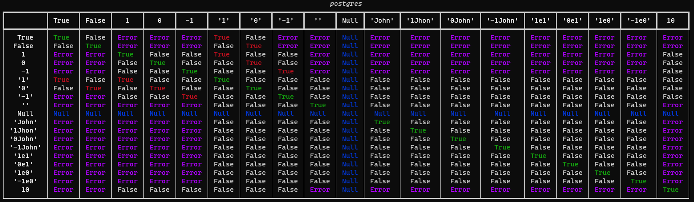
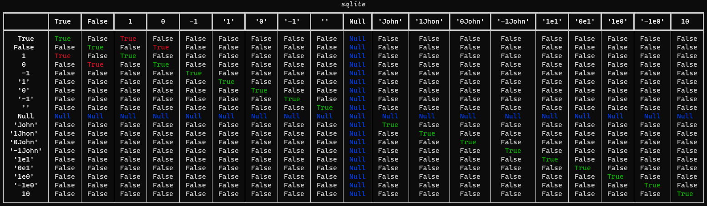

# Loose comparison

<p align="center">
  A complete table of results of types comparison in multiple languages
  <br>
  <br>
</p>

## Abstract 
Loose comparison is a really common type of vulnerability. Recently, I tried to generate tables for every version of every language in order to highlight the specific behaviors of each versions. In this repo you will find a list of all the results of comparisons between different data types, in PHP, MySQL, MariaDB, Postgres, Perl, NodeJS, Python, SQLite. 


## Examples of Results

### mariadb


### mysql


### postgres



### sqlite



## Script usage 

To use this script:

```bash
python3 -m pip install -r requirements.txt
python3 loose_compare.py [-h] [-l LANGUAGE] [--version VERSION] [--filter FILTER] [-L] [-q] [-v VERBOSE] [--all]
```

## Contributing

Pull requests are welcome. Feel free to open an issue if you want to add other features.
